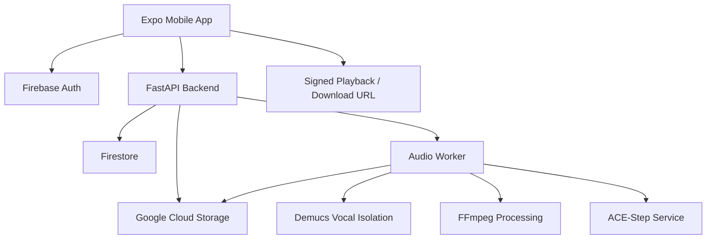

# Skarly

Skarly is a private demo studio for singers, rappers, and indie creators. It turns rough voice notes, humming, rap flows, or melody ideas into structured demo projects with idea analysis, BPM/key estimates, chords, arrangement sections, backing audio, stems, MIDI, chord sheets, and a producer-ready ZIP export.

The project began as a design prototype and evolved into a real full-stack MVP foundation. The frontend is built with React Native and Expo. The backend is built with FastAPI and integrates Firebase Auth, Firestore, Google Cloud Storage, FFmpeg, Demucs, and an external music generation service path.

## Research Internship Package

The repository now includes a reproducible research layer around the working application. The existing vocal-to-music and music-to-music generation paths remain intact; the product change is a compact reference-inspired playback preview beneath the five final versions.

- Start locally: [QUICKSTART.md](QUICKSTART.md)
- Exact service commands: [RUN_COMMANDS.md](RUN_COMMANDS.md)
- Executed neural-network, CNN, and signal-analysis notebook: [research/Skarly_Audio_Intelligence_Research.ipynb](research/Skarly_Audio_Intelligence_Research.ipynb)
- Research assets and reproduction notes: [research/README.md](research/README.md)
- Complete 25-screen live guest UI catalogue: [docs/ui-screenshots/README.md](docs/ui-screenshots/README.md)
- Final PDF report: [output/pdf/Skarly_Research_Internship_Report.pdf](output/pdf/Skarly_Research_Internship_Report.pdf)
- Editable Word report: [docs/research-report/Skarly_Research_Internship_Report.docx](docs/research-report/Skarly_Research_Internship_Report.docx)

The supplied case-study audio is read from a local runtime path and is intentionally not committed or used as training data.

## Repository Structure

- `lyricmorph-mobile`: React Native + Expo app for Skarly.
- `lyricmorph-backend`: FastAPI backend for authentication, profile/history persistence, storage, job orchestration, admin visibility, and audio worker execution.
- `outputs`: historical design, phase, and handoff documents.
- `HANDOFF.md`: practical setup guide for another developer.
- `GITHUB_PREP.md`: checklist for safely publishing the repository to GitHub.

Folder names still use the earlier working name in a few places, but the product name used in the app and documentation is Skarly.

## Product Scope

Skarly is scoped as a private creator tool, not a public social music platform or full AI song replacement. The app supports guest sessions and saved accounts, accepts short audio inputs, and creates a structured demo package. The current product boundary intentionally excludes payments, public feeds, voice cloning, and copyrighted remix workflows.

Current input limits:

- Guest creators: up to 30 seconds.
- Saved creators: up to 60 seconds.
- One generation flow at a time.
- Demo exports: MP3, WAV, vocal/backing stems, MIDI, chord sheet, and Producer Pack ZIP.

Current genres:

- Lo-fi
- Piano
- Pop
- Rock
- R&B
- Hip-hop
- Acoustic
- Cinematic

## Current State

- Firebase Auth is used for saved creator accounts.
- Guest mode remains temporary and session-scoped.
- Firestore stores saved creator profile, project/job, library, and voice-take metadata.
- SQLite is the default local project vault; cloud deployments can still use Firestore with `SKARLY_REPOSITORY_BACKEND=firestore`.
- Google Cloud Storage stores raw uploads, demo exports, stems, and producer packs in a private bucket.
- Signed URLs are used for controlled upload and download access.
- The frontend can record audio, upload files, select genres, run processing, name demo projects, review idea analysis/song blueprints, export producer packs, manage the Idea Vault, and access a restricted admin panel.
- The backend owns job creation and worker execution.
- Local backend development can run jobs inline.
- Cloud Tasks support is prepared for deployment.
- The audio worker can create a real demo package through FFmpeg and a generated backing layer, including MP3/WAV, stems, MIDI, chord sheet, blueprint JSON, and Producer Pack ZIP.
- Demucs support was added for vocal isolation from uploaded mixes.
- ACE-Step integration was added as the open-source AI generation direction.
- Admin Panel access is restricted by `SKARLY_ADMIN_EMAILS` and `SKARLY_ADMIN_UIDS`.

## Phase History

### Phase 1: MVP Definition

The first phase established the practical product boundary. The app was defined as a short-form vocal-to-MP3 tool where a user records or uploads audio, selects a genre, waits for generation, then plays or downloads the result. The MVP stayed intentionally small so the prototype could become usable quickly.

The most important decision in this phase was keeping the app focused on original vocal creation. The workflow avoids payments, public sharing, copyrighted remixing, and voice cloning. This made the product easier to reason about technically and safer to explain to future developers.

### Phase 2: Design Direction

The second phase created the design language for the app. The direction moved toward a dark, polished, Apple-influenced creator interface with a music-studio feel. The design leaned on clean surfaces, strong spacing, genre-aware waveform visuals, and simple controls.

The visual identity later shifted toward the Skarly branding: black, smoky, gold-accented, cinematic, and minimal. The splash screen, app icon, loading treatment, bottom navigation, buttons, genre cards, library rows, and profile screens were repeatedly refined to feel more like a real mobile product than a prototype.

### Phase 3: Expo Frontend Prototype

The third phase converted the design package into a working Expo app. The frontend gained the core mobile flow: splash, account choice, creator setup, home, record, upload, genre selection, processing, naming, result player, download/share, track library, and profile/settings.

At this stage the app still used dummy state, but the full navigation path existed. That was important because it allowed every future backend feature to connect to an already visible user experience instead of being built in isolation.

### Phase 4: Demo Hardening

The fourth phase improved the prototype so it felt more intentional during demos. Upload and record screens gained clearer states. Buttons, icons, toast messages, bottom navigation behavior, profile reset, and library organization were refined.

The upload flow moved from dummy file choices to a real local file picker. The app could show selected filenames, accepted formats, selected source type, and remove-file behavior. The goal was still frontend-first, but the app began behaving like a real mobile tool.

### Phase 5: Backend Architecture

The fifth phase introduced the backend plan and scaffold. FastAPI became the backend contract for upload signing, job creation, job polling, history, profile, worker execution, and future cloud integrations.

This phase defined the larger architecture: mobile app, Firebase Auth, FastAPI, Firestore, Cloud Storage, queued worker execution, audio processing, and final MP3 delivery. Later phases replaced early mock behavior with real Firebase, Firestore, Cloud Storage, and worker logic while keeping the API shape stable.

### Phase 6: Frontend and Local Backend Integration

The sixth phase connected the Expo app to the local FastAPI backend. The app gained an API client for upload signing, job creation, job polling, history loading, retry behavior, raw deletion, and local worker execution.

This phase proved that the frontend and backend could communicate through a realistic contract. It also introduced fallback handling so the app could remain usable during local development if the backend was not running.

### Phase 7: Firebase Authentication

The seventh phase replaced fake saved-user behavior with Firebase Auth. The app gained real sign up, sign in, logout, session restore, duplicate email handling, and Firebase ID token usage for backend calls.

The backend gained Firebase Admin token verification. Saved users are identified by Firebase UID, while guest sessions remain temporary. This made account switching, protected history, and user-scoped backend access possible.

### Phase 8: Google Cloud Storage

The eighth phase connected the backend to a private Google Cloud Storage bucket. The backend can generate signed upload and download URLs, and the frontend can upload selected audio through the backend storage contract.

The bucket is private with uniform access and public access prevention. Files are organized under user-scoped paths so user data does not collide. The frontend later gained a backend byte-upload fallback for cases where browser-to-GCS signed PUT is blocked by CORS.

### Phase 9: Firestore Persistence

The ninth phase moved saved creator state from in-memory/local behavior to Firestore. Saved profiles, jobs, history, generated tracks, and voice-take metadata can be stored under each Firebase user.

The backend repository layer supports both memory and Firestore modes. Firestore is the real saved-user source of truth, while memory mode remains useful for isolated automated tests. Duplicate profile email protection is handled with a separate normalized email mapping.

### Phase 10: Real Recording Input

The tenth phase replaced simulated recording with actual audio capture. On web, the app uses the browser `MediaRecorder` path where available. Native Expo builds use Expo audio APIs.

Recorded takes now have local URI, duration, content type, and size metadata. They can be played, saved, deleted, uploaded, or used for conversion. The Track Library separates voice recordings from generated tracks so users can manage raw takes and completed mixes separately.

### Phase 11: MVP Audio Worker

The eleventh phase introduced real backend audio output. The worker downloads raw audio from storage, normalizes it with FFmpeg, creates a genre-aware backing layer, mixes the result, uploads a final MP3, and returns signed playback/download URLs.

This moved the app away from fake generated results. The generated backing was intentionally simple at first, but it proved that raw input, backend processing, MP3 creation, storage upload, and result playback could work end to end.

### Phase 12: Backend-Owned Job Execution

The twelfth phase moved worker triggering into the backend. The frontend no longer needs to directly call a worker route to complete a job. Instead, it creates a job and polls until the backend marks the job ready or failed.

Local development uses inline execution. Deployment can switch to Cloud Tasks so job processing can run asynchronously behind a Cloud Run worker.

### Phase 13: Cloud Run and Cloud Tasks Planning

The thirteenth phase prepared the deployment path. Documentation and helper scripts were added for Cloud Run deployment, Cloud Tasks queue setup, worker secrets, CORS, and environment configuration.

The project is not fully deployed in this handoff, but the structure is ready for a cloud deployment pass once the environment, service account, queue, and runtime dependencies are finalized.

### Phase 14: Procedural Music Quality Upgrade

The fourteenth phase improved the built-in generator. The earlier backing bed was upgraded into a more layered procedural generator with genre profiles, chord movement, bass, drums, lead accents, stereo movement, and simple mix shaping.

This was still not full AI music generation, but it made the app produce more realistic genre differences while external AI generation was being researched and prepared.

### Phase 15: Provider and Cost Planning

The fifteenth phase compared options for real music generation. The project considered cloud model APIs, budget limits, open-source models, and the tradeoff between cost, quality, control, and local hardware requirements.

The direction settled on open-source experimentation first, with budget-controlled cloud generation kept as a possible future option. Admin cost visibility was added as a requirement so cloud usage could be watched from inside the app.

### Phase 16: ACE-Step Integration Direction

The sixteenth phase added ACE-Step as the main open-source generation direction. The backend gained configuration for an external ACE-Step service, while the app and backend kept the existing job contract.

ACE-Step is expected to run as a separate service, usually with GPU support. The FastAPI app sends generation intent and receives generated audio from that service path. This keeps the mobile/backend app lighter while allowing the music model to run independently.

### Phase 17: Vocal Isolation and Vocal-Aware Generation

The seventeenth phase addressed a core audio quality issue: uploaded songs or full mixes still contained their original instrumental. Demucs was added as a stem-separation step so uploaded mixes can be converted into an isolated vocal layer before new backing music is generated.

The worker stages were expanded to include vocal isolation, timing analysis, backing generation, and mixing. Uploaded full mixes require isolation. Direct microphone recordings can skip isolation because they should already be vocal-only.

This phase also adjusted prompts and generation behavior to avoid reconstructing the original song. The goal is to use isolated vocals for timing and structure, then generate a new backing arrangement that supports the vocal instead of stacking over the old beat.

### Phase 18: Library Reliability and Audio QA

The eighteenth phase focused on reliability and debugging. Generated tracks needed to play, download, delete, and recover consistently. Stale placeholder jobs and orphaned final files were hidden from the normal library, and cleanup/recycle behavior was improved.

The audio worker gained stronger metadata and preview concepts so future testing can separate three questions: whether vocal isolation worked, whether the generated backing is useful, and whether the final mix is balanced. This phase is especially important because audio quality issues can come from separation, generation, timing, or mixing.

## Current Architecture



## Run Frontend

```bat
cd C:\Users\yeshw\Documents\Codex\2026-06-05\files-mentioned-by-the-user-lyric\lyricmorph-mobile
npm run web
```

## Run ACE-Step API

ACE-Step is a separate local model service and must be started before real AI generation.

```bat
cd D:\intern\Skarly-git
powershell -ExecutionPolicy Bypass -File tools\start-ace-step-api.ps1
```

Expected output:

```text
Uvicorn running on http://127.0.0.1:8001
```

Do not use `python app.py` for this checkout. Skarly talks to the ACE-Step API at `http://127.0.0.1:8001`.

The pulled local AI repos and build status live at:

```text
D:\intern\skarly-ai-repos\BUILD_STATUS.md
```

Frontend Firebase config lives in `lyricmorph-mobile/.env`:

```text
EXPO_PUBLIC_FIREBASE_API_KEY=
EXPO_PUBLIC_FIREBASE_AUTH_DOMAIN=
EXPO_PUBLIC_FIREBASE_PROJECT_ID=
EXPO_PUBLIC_FIREBASE_APP_ID=
EXPO_PUBLIC_BACKEND_BASE_URL=http://localhost:8090
```

## Run Backend

```bat
cd C:\Users\yeshw\Documents\Codex\2026-06-05\files-mentioned-by-the-user-lyric\lyricmorph-backend
set PYTHONPATH=.;.pydeps
C:\Users\yeshw\.cache\codex-runtimes\codex-primary-runtime\dependencies\python\python.exe dev_server.py
```

Backend real-service env:

```text
AUTH_MODE=firebase_with_guest
FIREBASE_PROJECT_ID=lyricmorph
FIREBASE_CREDENTIALS_PATH=C:\Users\yeshw\Documents\Codex\firebase\lyricmorph-service-account.json
SKARLY_REPOSITORY_BACKEND=firestore
SKARLY_STORAGE_BACKEND=gcs
SKARLY_STORAGE_BUCKET=lyricmorph-user
SKARLY_WORKER_BACKEND=mvp_audio
SKARLY_MUSIC_GENERATOR_BACKEND=ace_step
SKARLY_STEM_SEPARATOR_BACKEND=demucs
SKARLY_DEMUCS_PATH=D:\intern\skarly-ai-repos\_envs\demucs\Scripts\python.exe -m demucs.separate
SKARLY_DEMUCS_MODEL=htdemucs
SKARLY_DEMUCS_TWO_STEMS=vocals
SKARLY_MELODY_ANALYZER_BACKEND=basic_pitch
SKARLY_BASIC_PITCH_PATH=D:\intern\skarly-ai-repos\_envs\basic-pitch\Scripts\basic-pitch.exe
SKARLY_BASIC_PITCH_MODEL_SERIALIZATION=onnx
SKARLY_ACE_STEP_USE_SOURCE_AUDIO=false
SKARLY_ACE_STEP_BASE_URL=http://127.0.0.1:8001
SKARLY_ACE_STEP_TIMEOUT_SECONDS=1800
SKARLY_ACE_STEP_DOWNLOAD_TIMEOUT_SECONDS=1800
SKARLY_ACE_STEP_INFER_STEP=20
SKARLY_ACE_STEP_GUIDANCE_SCALE=15
SKARLY_ACE_STEP_MAX_DURATION_SECONDS=150
SKARLY_ACE_STEP_FALLBACK_TO_PROCEDURAL=false
SKARLY_ACE_STEP_SEND_LYRICS=false
SKARLY_AUDIOCRAFT_BACKEND_STATUS=blocked_windows_av_dependency
SKARLY_BACKING_VOCAL_CLEANUP_ENABLED=true
SKARLY_BACKING_MIX_GAIN=0.06
SKARLY_TASK_BACKEND=inline
SKARLY_CORS_ORIGINS=https://your-frontend-domain
SKARLY_ADMIN_EMAILS=yeshwant_satyada@srmap.edu.in
SKARLY_ADMIN_UIDS=64EbLsRLTmflRHae5oJgrqQFs8f1
```

## MVP Boundaries

- Guest vocal input is limited to 30 seconds.
- Saved creator vocal input is limited to 60 seconds.
- One generation at a time.
- MP3/WAV/stem/MIDI/chord-sheet/ZIP demo exports.
- No payments.
- No remixing copyrighted songs.
- No AI voice cloning.
- No social feed.

## Known Limitations

- Guest mode is still temporary.
- Cloud Tasks deployment still needs a real queue and Cloud Run worker URL.
- The current recommended open-source path is ACE-Step through `SKARLY_MUSIC_GENERATOR_BACKEND=ace_step`.
- ACE-Step is not bundled into the FastAPI service. Run ACE-Step as a separate GPU-backed service and point Skarly to it with `SKARLY_ACE_STEP_BASE_URL`.
- Full-mix uploads need Demucs installed for vocal isolation. Without Demucs, uploaded songs/mixes fail with `Vocal isolation failed` instead of incorrectly mixing the old beat into the new output.
- On Windows, the safest local value is `SKARLY_DEMUCS_PATH=C:\Users\yeshw\Documents\Codex\ai-models\ACE-Step-1.5\.venv\Scripts\python.exe -m demucs.separate`, after installing Demucs into the ACE-Step venv.
- Browser-to-GCS signed PUT can be blocked by CORS; the frontend now falls back to `POST /v1/uploads/bytes` so FastAPI can upload the same audio bytes to Cloud Storage.
- ACE-Step currently uses isolated vocals for timing analysis and prompt construction, while `SKARLY_ACE_STEP_USE_SOURCE_AUDIO=false` avoids ACE trying to continue/reconstruct the uploaded song.
- The mobile vocal-to-music flow now sends language, optional lyric emotion, production style, instruments, duration, and mix focus into the same backend job path. `SKARLY_ACE_STEP_SEND_LYRICS=false` keeps ACE-Step instrumental by default; turn it on only if you intentionally want ACE-Step to receive the lyrics field.
- Generated ACE backing is passed through a no-vocals cleanup step before final mixing when `SKARLY_BACKING_VOCAL_CLEANUP_ENABLED=true`.
- AudioCraft is kept as an optional research backend for now. The local `D:\intern\skarly-ai-repos\BUILD_STATUS.md` notes that AudioCraft is blocked on this Windows setup by the native `av`/FFmpeg development-library dependency, so ACE-Step remains the real generation path.
- Local real-generation development uses ACE-Step. Keep ACE-Step running before starting a generation.

## Next Step

The next practical step is audio validation, not new UI. Run one upload through the full pipeline, listen to the isolated vocal preview, listen to the generated backing preview, then listen to the final mix. If the old instrumental is still audible, focus on Demucs/separation settings. If the backing is repetitive or mismatched, focus on ACE-Step prompt and timing conditioning. If both parts sound acceptable separately but poor together, focus on FFmpeg mixing, gain, ducking, and limiter settings.

Deployment checklist: [outputs/phase13_cloud_run_tasks_plan.md](C:/Users/yeshw/Documents/Codex/2026-06-05/files-mentioned-by-the-user-lyric/outputs/phase13_cloud_run_tasks_plan.md)

Backend deployment helpers:

```bat
cd C:\Users\yeshw\Documents\Codex\2026-06-05\files-mentioned-by-the-user-lyric\lyricmorph-backend
deploy_cloud_tasks_queue.cmd
set SKARLY_WORKER_SHARED_SECRET=replace-with-a-long-random-secret
deploy_cloud_run.cmd
```
